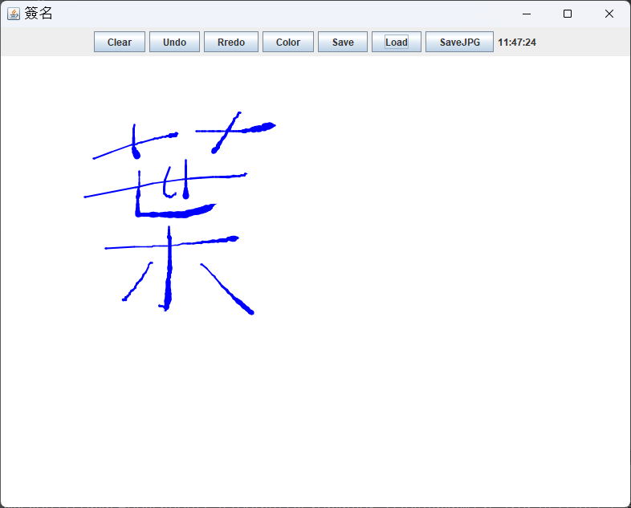

# 簡易簽名板（Java）

這是一個使用 Java 語言開發的簡易簽名板專案，具備以下功能：

- 簡單的筆觸模擬
- 選擇筆刷顏色
- 復原筆劃
- 儲存和載入繪圖數據
- 輸出為 JPG 檔案

## 功能特色

### 筆觸模擬

簽名板使用筆觸模擬技術，當使用者在繪圖區域繪製時，筆觸會根據使用者的移動軌跡模擬更自然的效果。

### 選擇筆刷顏色

使用者可以從可用的顏色列表中選擇筆刷顏色，讓使用者能夠根據需求進行繪製，獲得更多個性化的效果。

### 復原筆劃

簽名板支援復原功能，使用者可以撤銷之前繪製的筆劃。這在使用者對繪製結果不滿意時非常有用。

### 儲存和載入繪圖數據

使用者的繪圖數據可以被儲存到檔案中，以供之後再次載入。這樣使用者可以在退出應用程式後重新載入之前的繪圖內容，方便後續編輯或分享。

### 輸出為 JPG 檔案

使用者可以將繪製的簽名另存為 JPG 圖像檔案。這使得使用者可以輕鬆地分享或使用簽名圖像。

## 如何使用

請按照以下步驟使用此簽名板專案：

1. 將專案複製到您的本機環境。
2. 使用 Java 開發環境（例如 Eclipse 或 IntelliJ IDEA）打開專案。
3. 編譯並執行專案。
4. 在簽名板界面上使用滑鼠進行繪製。
5. 使用筆刷顏色選擇器選擇所需的顏色。
6. 如需復原筆劃，可使用撤銷功能。
7. 點擊儲存按鈕將繪製的內容儲存到檔案中。
8. 點擊匯出按鈕將繪製的內容輸出為 JPG 圖像檔案。

## 範例

這是使用該簽名板專案繪製的範例。